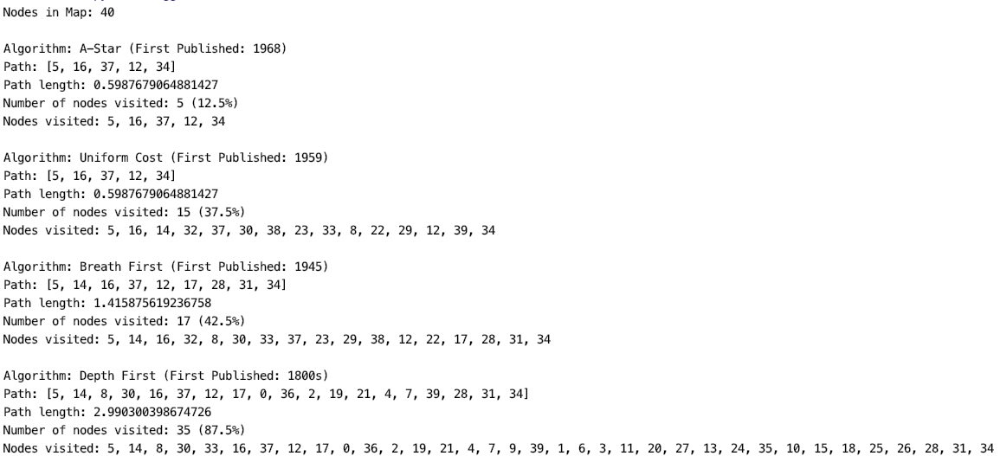
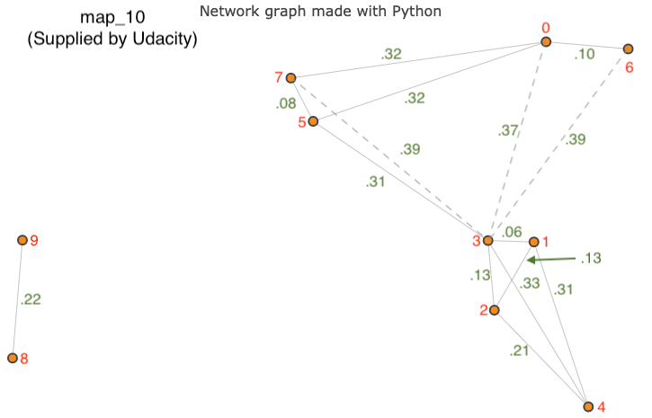
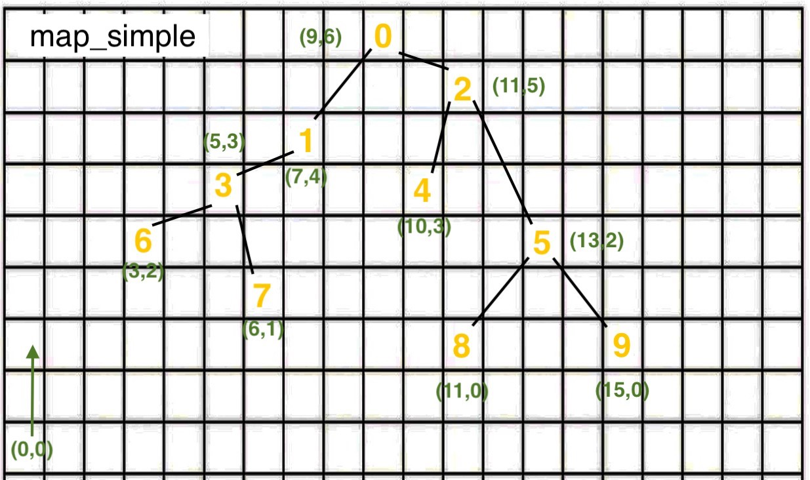

# Understanding Search Algorithms
**Purpose**

The purpose of this project is to help students and other programmers gain a better understanding of search algorithms.

It provides a sandbox of four search algorithm implementations written in Python, three graphs of different complexities, and a test suite of configurable experiments that show how the different algorithms perform on the same search challenges.

The code for the algorithms is derived from a common class that demonstrates the fundamental structure of search, with documentation that highlights the common and unique components of each algorithm.

The algorithms implemented are:
* A-Star Search
* Uniform Cost Search
* Breath First Search
* Depth First Search

**Background**

I'm enrolled in the Udacity.com Intro to Self-Driving Cars Nano Degree program. I completed the Route Planner project, which demonstrates how web mapping apps like Google Maps provide the shortest possible route between different locations. Here is my implementation: https://github.com/vorian77/Udacity-ISDC-Route-Planner

After completing the project, I didn't completely understand A-Star search. I decided to play around with the project code by adding different search algorithms.

In the end, I got a great understanding of the mechanics of the search algorithms by comparing and contrasting the code with the results of the experiments, which show their operational and performance characteristics.

Another cool outcome was learning the history of these particular algorithms and how science advances the state of the art. They were published in a span from the 1800s to 1968. Each was advanced by computer scientists and mathematicians who were making improvements on the past versions to better solve a contemporary challenge.


## Table of Contents

* [Dependencies and Pre-requisites](#dependencies-and-pre-requisites)
* [Installation and Usage](#installation-and-usage)
* [Known Issues](#known-issues)
* [Future Plans](#future-plans)
* [Support](#support)
* [Contributing](#contributing)
* [Authors and Acknowledgement](#authors-and-acknowledgement)
* [License](#license)


## Dependencies and Pre-requisites
* Python 3.x (including math libraries)


## Installation and Usage

1. Copy the following files from the repo to a directory. 
2. In a terminal, navigate to the directory.
3. Execute `python3 test.py`.

**Execution Results**
Typical results from an execution of test.py



#### Changing The Experiments
In the test.py file, change the values of the variables:
* graph
* start_node
* goal_node

```
def main():
    """Use this program to compare and contrast four graph searching algorithms."""
    map_40 = load_map_40()
    map_10 = load_map_10()
    map_simple = load_map_simple()

    algorithms = [a_star, uniform_cost, breath_first, depth_first]

    # The loop below will execute the same search using each of the four algorithms.
    # Experiment with different maps and searches to understand the attributes,
    # performance characteristics, and code of each algorithm.
    graph = map_40
    start_node = 5
    goal_node = 34
```


#### Maps With Node IDs
**Map 1: map_40 (40 nodes)**

Large map - ideal for seeing the performance differences between the search algorithms


**Map 2: map_10 (10 nodes)**

Small map with key distances between points - ideal for experimenting with Uniform Cost Search and A-Star Search 


**Map 3: map_simple (10 nodes)**

Classic Tree structure - ideal for experimenting with Depth-First Search and Breath-First Search 



## Known Issues

None.


## Future Plans

To add more search algorithms.


## Support

Please open an issue to receive help.


## Contributing

Pull requests are welcome. Please open an issue to discuss any changes you would like to make or see.


## Authors and Acknowledgement

The code is derived from the template and test code that was part of coursework for the [Udacity - Introduction to Self-Driving Cars Nano Degree](https://www.udacity.com/course/intro-to-self-driving-cars--nd113)

* Unit: Navigating Data Structures
* Project: Implement Route Planner


## License

[MIT](https://choosealicense.com/licenses/mit/)
